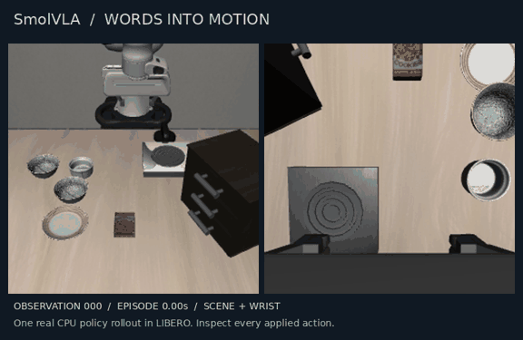
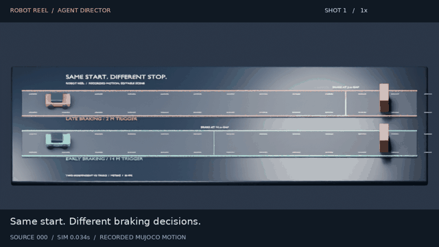

# Robot Reel

**Watch the robot. Inspect every move.**

Record physical-AI simulations as shareable films **and** interactive motion traces.
Run SmolVLA on a language-conditioned manipulation task, inspect Microduck's
walking policy, or turn a recorded experiment into an agent-directed Blender film.
Open the replay in a browser; no account or install needed to watch.
Keep the source actions, measured outcomes and editable Blender/OpenUSD scenes.

[**Watch SmolVLA work →**](https://noteflowai.github.io/robot-reel/vla/) ·
[**Try the agent director →**](https://noteflowai.github.io/robot-reel/director/) ·
[**Try Microduck →**](https://noteflowai.github.io/robot-reel/) ·
[**Compare braking →**](https://noteflowai.github.io/robot-reel/braking/) ·
[**Inspect the agent arm →**](https://noteflowai.github.io/robot-reel/studio/) ·
[**Open in Blender →**](https://noteflowai.github.io/robot-reel/blender/) ·
[**Newton → USD → Blender →**](https://noteflowai.github.io/robot-reel/newton/) ·
[中文](README.zh-CN.md)



[Download the VLA episode + evidence](https://noteflowai.github.io/robot-reel/vla/episode.zip) ·
[Download the directed Blender project](https://noteflowai.github.io/robot-reel/director/project.zip) ·
[Original pack releases](https://github.com/noteflowai/robot-reel/releases/tag/v0.3.0)

## New: words into motion, every action on record

**An actual SmolVLA policy rollout in LIBERO.** A language instruction asks the
arm to place a black bowl on a plate. The published CPU run completes the task
after 76 applied actions. Inspect both camera views, measured robot state,
normalized controls and inference chunks on one timeline. Share any observation
or download the complete offline episode.

Policy and asset revisions are pinned. This is one seeded simulation, not a
success-rate benchmark; CPU inference waiting time is omitted from playback.
LeRobot's recording environment is isolated from the original packs to preserve
their different MuJoCo versions. [Reproduce the real rollout](docs/vla.md).
Keep [upstream media attribution](licenses/VLA-MEDIA-NOTICE.txt) with its footage.

```bash
# Verify the included episode with the Python standard library.
python3 -m robot_reel.cli vla docs/vla
```

## New: let an agent direct the story

**Describe the presentation. Preserve the experiment.** Connect an MCP agent
to inspect the recorded events and create a checked storyboard. Build an
editable Blender film with overview, tracking, contact and top cameras,
captions, and half-speed playback that retains every source sample.



The seven-second example retains 180 source samples across 210 film frames.
All 420 vehicle samples, four cuts and the tracking camera were checked in
Blender 5.2.1. The browser shows the rendered example and exports edited plans
for a new render. [Connect an agent and build your own film](docs/director.md).

```bash
python3 -m robot_reel.cli direct docs/compare/braking \
  --plan examples/contact-storyboard.json --output artifacts/director
```

## New: Newton → OpenUSD → Blender

**Run the physics once. Share every pose.** Record a real Newton 1.6 double
pendulum on CPU, inspect its measured 3D poses in a browser, and import the same
animation into Blender. No GPU, API key, or downloaded scene assets needed.

[**Inspect the Newton replay + download the USD scene →**](https://noteflowai.github.io/robot-reel/newton/)


```bash
pip install -e '.[newton]'
robot-reel newton --output artifacts/newton
robot-reel newton --output artifacts/newton --verify --check-usd
```

Open `artifacts/newton/index.html`, or set Blender to **30 fps** and import
`scene.usda`. The six-second demo includes 181 samples, starting at simulation
time zero. All **362 body transforms** were checked after actual Blender 5.2.1
import. This is a rigid-body presentation export; the browser and Blender replay
the recorded poses. [Reproduce it, including the Blender import check](docs/newton.md).

## New: take a recorded run into Blender

**Keep the motion. Change the scene.** Export the verified braking comparison as
an editable Blender scene: two cameras, procedural materials, source-driven
keyframes, and animated speed/gap/contact channels.

[**Watch the Blender replay + download the project →**](https://noteflowai.github.io/robot-reel/blender/)


```bash
# Uses the comparison already included in this checkout. No recording dependencies.
python3 -m robot_reel.cli blender docs/compare/braking --output artifacts/blender
blender --background --python artifacts/blender/build_scene.py -- \
  --bundle artifacts/blender --output artifacts/blender/replay.blend
```

Tested with Blender 5.2.1 LTS. Every vehicle position comes from a recorded sample;
this is a stylized replay of the 1D experiment, with no new Blender physics.
[Reproduce it and check all 360 vehicle samples](docs/blender.md).

## New: two runs, one clock

[**Compare Microduck speeds →**](https://noteflowai.github.io/robot-reel/compare/microduck/) ·
[**Compare braking triggers →**](https://noteflowai.github.io/robot-reel/compare/braking/)

Synchronized raw videos, shared frame stepping, measured channels and downloadable
source traces. The CLI checks timestamps, model configuration and engine versions;
it rejects mismatched captures instead of silently trimming them. These are individual
trials, not a statistical benchmark. [Reproduce the comparisons](docs/comparison.md).

## MuJoCo recording packs

| Pack | What actually runs | What you can inspect |
| --- | --- | --- |
| **Microduck** | Pollen Robotics' official walking ONNX policy, 50 Hz, in CPU MuJoCo | 14 joint targets and responses, every policy step, base motion, pinned policy checksum |
| **Braking** | Two scripted controllers in the same 1D rigid-body vehicle surrogate | Speed, obstacle gap, brake force, recorded contact; early versus late braking |
| **Studio** | SO-100 position actuators; optional live Strands agent. G1 is a scripted kinematic segment | Four arm moves, endpoint errors, asset-defined home, frame-by-frame traces |

All footage comes from the simulator. Titles and telemetry are drawn in code;
the soundtrack is originally synthesized. The replay includes shot navigation,
single-frame stepping, joint selection, measured/reference plots, and timestamp sharing.

**Limits are visible:** Microduck uses the upstream XML PD-actuator fallback,
not the BAM motor model used for official deployment. Braking is a toy longitudinal
scenario, not CARLA, AlpaSim, an Alpamayo inference run, or a road-safety validation.
G1 does not demonstrate walking or a learned balance policy.

## Quick start

Python 3.12+ and OpenGL. Tested on Linux / NVIDIA L40S / EGL.

```bash
git clone https://github.com/noteflowai/robot-reel.git
cd robot-reel
python3.12 -m venv .venv
source .venv/bin/activate
pip install -e '.[microduck]'

# Official pretrained Microduck policy; no training or model-service account.
robot-reel --pack microduck --output artifacts/duck
python -m robot_reel.verify artifacts/duck
```

Open `artifacts/duck/index.html` directly. First run downloads the pinned upstream
model assets and policy. The policy runs on CPU; rendering needs OpenGL.
Set `ROBOT_REEL_CACHE` to choose the download cache.

Microduck model assets are identified upstream as **Creative Commons BY-SA-NC**
(the upstream README does not state a version). Its footage retains those asset
terms and attribution. Our recorder code is Apache-2.0; it does not relicense
Pollen's models. See [THIRD_PARTY.md](THIRD_PARTY.md).

For the other packs, plain `pip install -e .` is enough:

```bash
# Two braking runs with identical initial conditions.
robot-reel --pack braking --output artifacts/braking

# Credential-free arm + humanoid demo.
robot-reel --output artifacts/studio

# Your own four-shot arm plan; final shot returns to the model's home pose.
robot-reel --shots examples/close-up.json --output artifacts/my-film
```

The browser's plan editor exports a `shots.json` compatible with `--shots`.
Editing that plan does not modify or simulate the video currently playing.
Unknown joints, nonfinite targets, out-of-range targets and unsupported plan fields
are rejected. The first three targets retain unspecified joints; the fourth shot
must use `"home": true`.

Linux defaults to EGL; software rendering can use `MUJOCO_GL=osmesa` after
installing your system's OSMesa library. macOS defaults to `glfw`, but is not yet
part of the tested platform matrix.

## Outputs

Each MuJoCo pack produces two H.264/AAC films, an interactive HTML replay, original
simulator recordings, per-frame JSON traces, a poster, and a SHA-256 manifest.
Microduck also records all 50 Hz policy actions and its policy/model revisions.
The separate Newton command produces an HTML pose replay, JSON trace, animated
USD scene, and checksum manifest; it does not render an MP4.

| Pack | Simulation footage | Edited film |
| --- | --- | --- |
| Microduck | 10 seconds / 300 frames | 15 seconds |
| Braking | 2 × 6 seconds / 360 frames | 17 seconds |
| Studio | 16-second arm + 10-second G1 / 780 frames | 31 seconds |

Landscape is 1280×720; portrait is 720×1280, both 30 fps. Share the MP4, or keep
`index.html` beside the videos for an interactive local replay.

```bash
# Re-edit an existing capture, including a Microduck or braking pack.
robot-reel --render-only --output artifacts/duck

# Add the latest replay UI to an existing compatible evidence bundle.
python -m robot_reel.viewer artifacts/duck
```

## Optional: let an agent direct the arm

Configure AWS SDK credentials and select a Bedrock model/inference profile that
is available to you. This is a billable model call:

```bash
robot-reel --agent --model YOUR_BEDROCK_MODEL_OR_INFERENCE_PROFILE \
  --region us-west-2 --output artifacts/agent-film
```

The agent inspects limits and home, then issues four constrained moves. Its prompt
and response are saved. Inference pauses are omitted; motion frames remain in order.
This is a bounded demonstration, not open-ended autonomous planning.

## Evidence, not a certification

The verifier requires hashes for every scene's raw video and trace plus both films.
It checks frame ordering, finite values, source labels, arm action/frame agreement,
policy-step/frame agreement, and braking contact-summary agreement. Arm endpoint
and home error must remain within a 0.05-radian demo tolerance.

Hashes detect changes relative to a manifest. They are not signatures, do not
prove independent authenticity, and do not certify physical safety or general
policy quality. Driving outcomes apply only to the documented surrogate.

## Why this exists

[Microduck](https://github.com/pollen-robotics/microduck) and
[Microduck RL](https://github.com/pollen-robotics/microduck_rl) provide the robot
and learned behavior. [Strands Robots](https://github.com/strands-labs/robots)
provides agent/robot integration. Robot Reel focuses on **turning a run into
something people can watch, inspect and reproduce**.

The automotive pack is a small starting point for recording comparable outcomes.
See [the automotive integration notes](docs/automotive.md) for the relationship
to Alpamayo, AlpaSim and CARLA, and what is not integrated yet.

## Development

```bash
# Trace, plan and export tests run with the Python standard library.
python3 -m unittest discover -s tests -v
# For recording/rendering development, install the runtime in an isolated environment.
python3 -m venv .venv
source .venv/bin/activate
python -m pip install -e .
npm ci
npx playwright install chromium
npm test
```

The Python suite covers plan rejection, VLA outcome/action consistency, evidence
bundles and Blender export agreement. Importing validators does not require
`imageio_ffmpeg`, MuJoCo, NumPy or ML libraries;
CI also runs the suite with third-party packages disabled. Browser checks
cover both camera clocks, seeking, stepping, downloads, mobile layout, local-file
playback and caption escaping. CI also exercises the real director MCP transport.
Real recording smoke runs require OpenGL and downloaded model assets.
The Studio adapter uses private Strands Robots fields and pins version 0.5.1.

See [CONTRIBUTING.md](CONTRIBUTING.md). Useful contributions include a public
backend adapter, measured policy comparisons, and an import adapter for an actual
AlpaSim/CARLA run. Do not describe planned integrations as shipped features.
