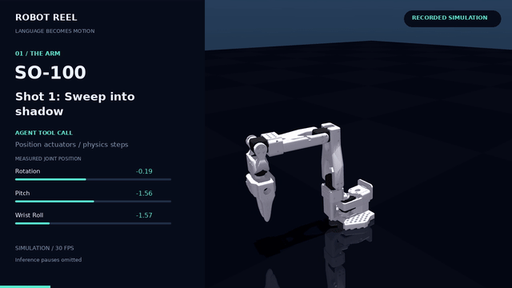

# Robot Reel

**一句指令，一段动作，一份可核验的记录。**

把机器人仿真运行制作成可分享的视频，同时保存每帧关节读数、动作目标和误差。
提供横版、竖版视频；默认模式不需要大模型账号，也可以让 Strands Agent
通过受限工具控制机械臂。




[Watch the film](https://noteflowai.github.io/robot-reel/) · [Download videos and evidence](https://github.com/noteflowai/robot-reel/releases/tag/v0.1.0)

## 当前已经实现

- SO-100：位置执行器驱动，实际运行 MuJoCo 物理步进。
- Unitree G1：固定根节点的关节姿态编排，画面明确标注为运动学展示。
- 31 秒视频：动态镜头、关节读数、动作来源、片头片尾。
- 原始画面、逐帧 JSON、文件 SHA-256 清单一起保存。
- 可选实时模型模式：检查关节和资产 home 姿态，执行四次动作，回读误差。

G1 当前没有行走或学习到的平衡策略。机械臂演示是限定的四镜头任务，
不代表开放环境下的自主规划。剪辑省略模型思考等待，动作帧保留原顺序。

## 运行

需要 Python 3.12+ 和可用的 OpenGL 后端。第一次运行可能需要下载机器人资产。

```bash
git clone https://github.com/noteflowai/robot-reel.git
cd robot-reel
python3.12 -m venv .venv
source .venv/bin/activate
pip install -e .
robot-reel --output artifacts/my-first-film
python -m robot_reel.verify artifacts/my-first-film
```

Linux 默认使用 EGL；软件渲染可在安装系统 OSMesa 库后设置
`MUJOCO_GL=osmesa`。macOS 请设置 `MUJOCO_GL=glfw`。
当前实测环境是 Linux、NVIDIA L40S、EGL。

输出包括 `robot-reel.mp4`（1280×720）、`robot-reel-vertical.mp4`
（720×1280）、封面、原始仿真视频、逐帧记录和校验清单。

## 模型导演模式

先配置 AWS SDK 凭据，选择该区域可访问的 Bedrock 模型或推理配置：

```bash
robot-reel --agent \
  --model YOUR_BEDROCK_MODEL_OR_INFERENCE_PROFILE \
  --region us-west-2 \
  --output artifacts/agent-film
```

这会产生模型调用费用，并保存提示词和最终回复。
工具会拒绝未知关节、非有限角度和越界目标，不提供真机控制入口。
模型需要完成四次动作；校验器检查动作误差与回到 home 的误差是否在
0.05 弧度以内。

已有录制可以重新剪辑，不重复调用模型：

```bash
robot-reel --render-only --output artifacts/agent-film
```

## 为什么单独开源

Strands Robots 解决机器人与 Agent 的连接，LeRobot 面向机器人学习。
Robot Reel 专注于“**让仿真演示容易分享，也容易复核**”，在现有生态上提供
一个具体的成品流程。

目前是早期预览：两个场景、一个仿真后端、一个可选模型提供方。
适配层使用 Strands Robots 的内部字段，因此锁定 0.5.1 版本。
校验清单能检测文件相对清单的变化，不是数字签名，也不证明自主能力或任务成功。

代码使用 Apache-2.0；模型资产单独下载并保留原始许可。
详见 [第三方说明](THIRD_PARTY.md) 和 [英文 README](README.md)。
