<p align="center">
  <a href="https://noteflowai.github.io/robot-reel/remix/">
    <picture>
      <source media="(prefers-reduced-motion: reduce)" srcset="docs/showcase/hero.png">
      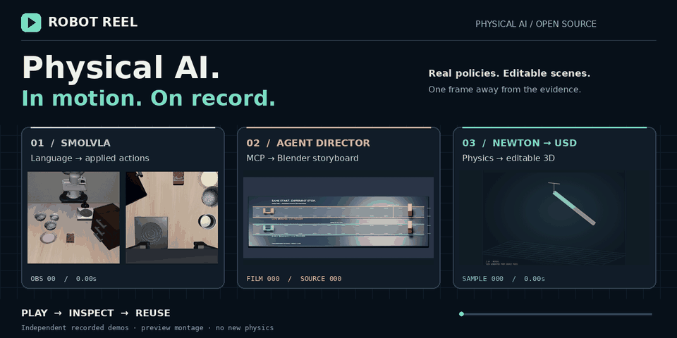
    </picture>
  </a>
</p>

<h1 align="center">物理 AI，一键回放。</h1>

<p align="center">
  真实运行的策略，可逐帧检查的影片，可继续编辑的三维场景。<br>
  看见行为，查看证据，把场景带走。
</p>

<p align="center">
  <a href="https://github.com/noteflowai/robot-reel/actions/workflows/check.yml"></a>
  <a href="https://github.com/noteflowai/robot-reel/releases/latest"></a>
  <a href="LICENSE"></a>
  <a href="https://noteflowai.github.io/robot-reel/"></a>
  <a href="https://huggingface.co/spaces/glayguo/robot-reel"></a>
  <a href="https://www.python.org/downloads/"></a>
  <a href="https://github.com/noteflowai/robot-reel/stargazers"></a>
</p>

<p align="center">
  <a href="https://noteflowai.github.io/robot-reel/stress/"><strong>◉ 体验策略压力实验室</strong></a> &nbsp; · &nbsp;
  <a href="https://noteflowai.github.io/robot-reel/chaos/"><strong>✦ 进入蝴蝶效应实验室</strong></a> &nbsp; · &nbsp;
  <a href="https://noteflowai.github.io/robot-reel/remix/"><strong>◐ 拖动体验前后对照</strong></a> &nbsp; · &nbsp;
  <a href="https://github.com/noteflowai/robot-reel/releases/latest"><strong>下载演示包 ↓</strong></a> &nbsp; · &nbsp;
  <a href="README.md">English</a>
</p>

<p align="center"><sub>观看无需安装，无需账号。封面各面板展示独立录制的运行。</sub></p>

**把 Microduck 的一帧交给客户复核。** 下载离线实验和配套帧 JSON，使用安装包中的
`robot-reel microduck-review` 独立检查原始记录与帧事实，无需克隆源码或 GPU。
[离线操作说明](docs/offline-lab.md)。

## 0.11.0：有原始证据的研究场景

[查看 27 次真实 GPU 技能评测](https://noteflowai.github.io/evalarc/skill-impact/)，并阅读[完整方法与限制](docs/research-pilots.md)。新增[实景 Blender 编辑](https://noteflowai.github.io/robot-reel/scene-lab/)与[官方 LIBERO-Plus 子集回放](https://noteflowai.github.io/robot-reel/libero-plus/)，把原始记录、技能交付与独立验收连接起来。失败尝试全部保留；不宣称技能提分、完整基准成绩或真机效果。


## 快速开始

**[在 Hugging Face 体验 Robot Reel](https://huggingface.co/spaces/glayguo/robot-reel)**：
在同一个 Space 对照 30 次 SmolVLA 运行、旋转查看 GPU 布料录制，
探索 12 个 Newton 世界，并逐关节检查 Microduck 的两组步行记录。无需安装或模型账号；Space 自带原始录制，
[构建与发布说明](docs/huggingface.md)提供对应源码提交和文件校验信息。
[模型与数据资源合集](https://huggingface.co/collections/glayguo/robot-reel-physical-ai-replay-lab-6aa67e950ba650285033a4d0) · [体验反馈与讨论](https://huggingface.co/spaces/glayguo/robot-reel/discussions/1)。

第一次体验可以从[三步导览](https://noteflowai.github.io/robot-reel/#tour)开始：
对照一组真实实验的不同结局，进入 Rerun 原生检查，再本地校验完整实验。
[场景库](https://noteflowai.github.io/robot-reel/#demos)支持按策略运行、实验对照和
三维创作筛选；预览点击后播放。

Python 3.12+，只需标准库就能校验一份真实录制：

```bash
git clone https://github.com/noteflowai/robot-reel.git
cd robot-reel

# 校验配对策略实验中的全部试次。
python3 -m robot_reel.cli stress docs/stress

# 检查已录制的策略运行与证据。
python3 -m robot_reel.cli vla docs/vla

# 把仓库自带的制动对照转成通过校验的分镜计划。
python3 -m robot_reel.cli direct docs/compare/braking \
  --plan examples/contact-storyboard.json --output artifacts/director
```

[](https://colab.research.google.com/github/noteflowai/robot-reel/blob/main/examples/quickstart.ipynb)
也可以使用[经过验证的安装包或普通用户 Docker 镜像](docs/distribution.md)；
安装包发布在 GitHub Releases，容器支持按宿主机 UID/GID 写出文件。
录制新的运行需要[完整运行环境](docs/recording.zh-CN.md)；浏览器演示什么都不用装。


## 新增 / 同一抛体，步长有多大影响？

**Solver Lab — Genesis × Newton。** 在 **L40S / CUDA** 上独立录制六次
抛体运动，以相同初始状态和重力，对比每秒 30、120、480 次积分的轨迹。
逐帧检查解析解、位置与速度误差，以及单位质量机械能变化。本次实验的
最大位置误差随步长缩小，从 **32.70 厘米降至 2.05 厘米**。

[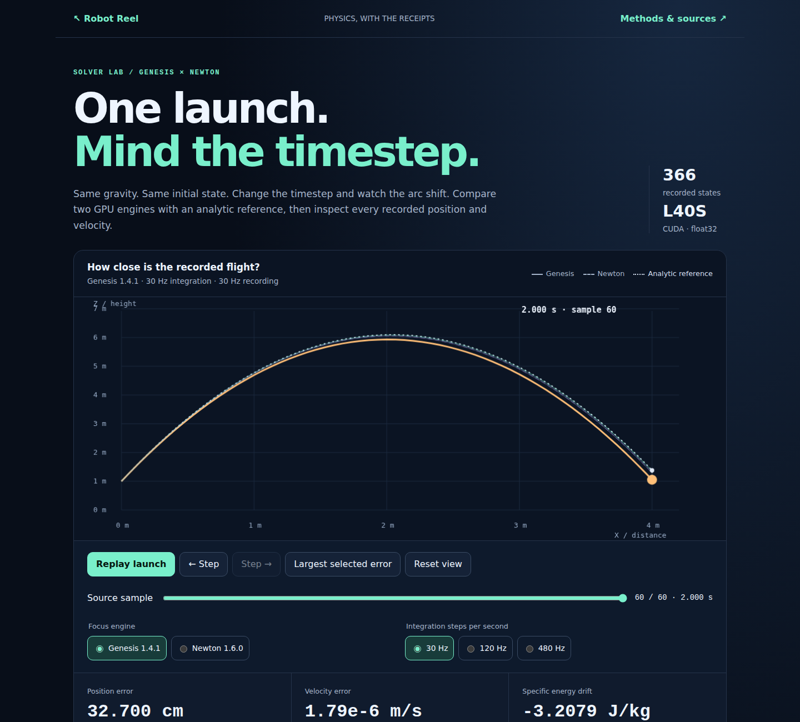](https://noteflowai.github.io/robot-reel/solver-lab/)

**[打开 Solver Lab ↗](https://noteflowai.github.io/robot-reel/solver-lab/)** ·
[完整离线实验](https://noteflowai.github.io/robot-reel/solver-lab/experiment.zip) ·
[场景、方程与复现方法](docs/solver-lab.md)

保留全部 **366 个位置与速度状态**，支持 JSON/CSV 导出，并逐帧核对
Genesis 原生回放与可编辑 OpenUSD。0.10.0 安装包可直接校验和导出离线实验。
两引擎在这个无碰撞、无阻力的简单场景中产生相同数值；这是积分误差诊断，
不代表仿真器排名或真实机器人准确率。

## 新场景 / 看懂 Microduck 的每一步

**Microduck 动作实验室。** 直接点选三维关节，拖动旋转查看结构，叠加策略目标姿态，点击
14 关节误差热图，与原始录像同步检查。切换 **0.3 / 0.5 m/s 速度命令**，
对照全部 **8,400 个实测关节样本**；分享指定帧，导出 JSON、CSV，
也能导入收到的帧 JSON，逐字段核对原始记录后恢复画面。支持完整离线实验。
播放控制紧邻三维结构，四个视角按钮支持键盘操作；视频加载失败可原位重试，
保留所选帧和关节，仍可查看数据或导出记录。
也可[让 Agent 复盘一帧](docs/agent-review.md)：通过 Skills Anywhere 加载技能，
先执行只读来源校验，再解释核实后的事实。

<a href="https://noteflowai.github.io/robot-reel/microduck-lab/">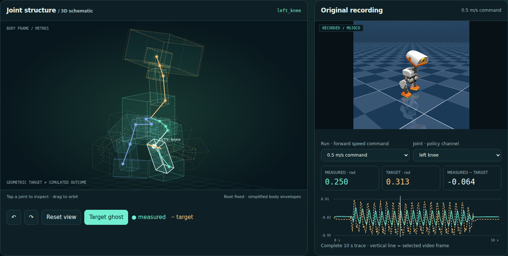</a>

**[进入 Microduck 动作实验室 ↗](https://noteflowai.github.io/robot-reel/microduck-lab/)** ·
[下载两组完整录制与离线查看器](https://noteflowai.github.io/robot-reel/microduck-lab/experiment.zip) ·
[方法与校验](docs/microduck-lab.md) ·
[交互灵感：mishig 的 Microduck Anatomy](https://huggingface.co/spaces/mishig/microduck-anatomy)

三维结构由固定版本的 Pollen 模型与原始关节角度计算，全部 **18,000 个变换**
已与 MuJoCo 核对。原录制没有机身朝向，因此结构图固定机身坐标，不推断足底接触。
这是 **PD 执行器近似下的仿真**，不是硬件结果；模型衍生结构与录像保留上游非商业、
相同方式共享条款。本实验室为原创实现，没有复制参考 Space 的代码或素材。

## 同一张布，三种形变

**布料实验室 Cloth Lab。** 在 **NVIDIA L40S** 上运行三组独立 Newton
布料仿真，网格、固定边、质量和重力完全相同，只改变弯曲系数。
旋转观察形变，叠加对照同一时刻的网格，逐帧检查差异，再把场景带进 Blender。
原始数据保留全部 **42,471 个顶点样本**，并经过 OpenUSD 和 Blender 原生读回校验。
当前实验室还支持导出附实测指标和数据指纹的 **1920 × 1080 演示图片**，
以及保留完整精度的样本 JSON；分享链接会保存旋转视角，方便团队恢复同一画面讨论。
收到 JSON 后可直接导入，核对原始记录并恢复画面；当前源码的命令行也支持独立校验，
无需 GPU 或 Newton，浏览器导入可断网使用。

<a href="https://noteflowai.github.io/robot-reel/cloth/">
  <picture>
    <source media="(prefers-reduced-motion: reduce)" srcset="docs/cloth/poster.png">
    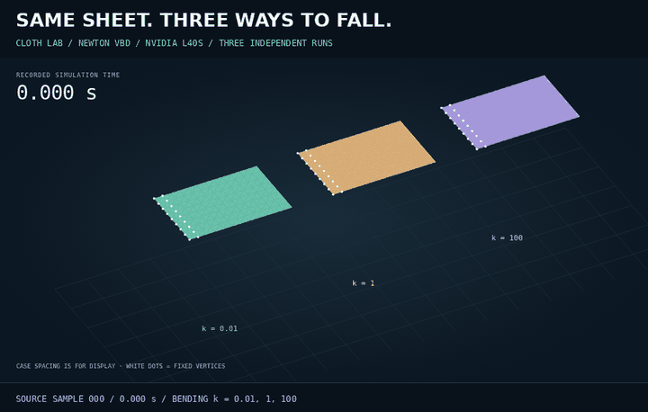
  </picture>
</a>

**[释放三张布，开始体验 ↗](https://noteflowai.github.io/robot-reel/cloth/)** ·
[完整离线实验](https://github.com/noteflowai/robot-reel/releases/download/v0.8.0/robot-reel-cloth-experiment.zip) ·
[可编辑 OpenUSD](https://github.com/noteflowai/robot-reel/releases/download/v0.8.0/robot-reel-cloth-scene.usdc) ·
[方法、边界与复现](docs/cloth.md)

弯曲系数是求解器设置，不代表经过标定的真实织物属性；颜色用于区分实验。
页面同时给出几何诊断，保留原始 float32 位置和速度。本场景未启用碰撞或自碰撞。
网页观看无需 GPU；**0.7.0+ 安装包**包含布料校验与完整离线导出，
见[安装说明](docs/distribution.md)。重新录制需要可选 Newton 环境。

## 换一束光，看策略如何改变

**策略压力实验室。** 让 SmolVLA 在参考光照、降低灯光强度和移动相机三种条件下，
从十组配对初始状态执行同一个任务，保留 **30 次真实闭环运行**。
点击结果矩阵查看任意成功或失败样本，对照策略的两个相机视角，
逐帧检查动作和推理记录，一键跳到实测末端轨迹差异最大的位置。
使用 **NVIDIA L40S / CUDA 推理**，每份记录均包含硬件信息和实测耗时。

<a href="https://noteflowai.github.io/robot-reel/stress/">
  <picture>
    <source media="(prefers-reduced-motion: reduce)" srcset="docs/stress/poster.png">
    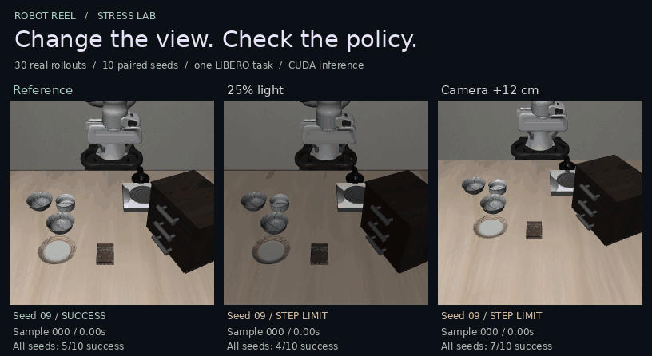
  </picture>
</a>

**[对照策略运行 ↗](https://noteflowai.github.io/robot-reel/stress/)** ·
[完整离线实验包 ↓](https://github.com/noteflowai/robot-reel/releases/download/v0.8.0/robot-reel-stress-experiment.zip) ·
[MCAP 遥测数据 ↓](https://noteflowai.github.io/robot-reel/stress/telemetry.mcap) ·
[在 Foxglove 中打开](docs/telemetry.md) ·
[复现与检查](docs/stress.md)

**把具体时刻带进团队复盘。** 将选中的配对样本和个人备注导出为 JSON 或可读
Markdown，重新导入可恢复原始样本位置，也可用命令行与完整本地实验逐项比对。
记录明确标注末帧停留，保留完整实验统计，个人备注与录制事实分开。
[复盘流程与核验命令](docs/stress.md#share-a-moment-for-review)。

**[逐次检查失败](https://noteflowai.github.io/robot-reel/stress/#failures)。** 按记录类别筛选，直接跳到每个回合的末段运动窗口，并查看以毫米表示的末端移动距离。

[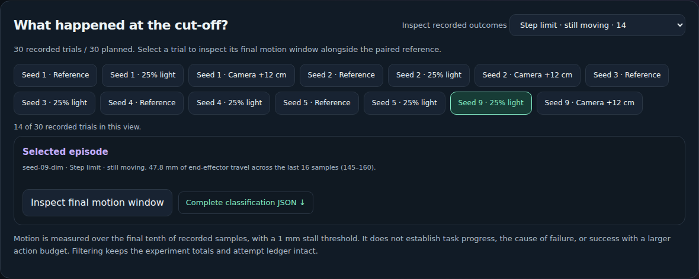](https://noteflowai.github.io/robot-reel/stress/#failures)

**失败究竟是什么。** 成功率不回答这个问题。这里 14 次失败全部止于步数上限，而这个标签
同时涵盖「策略停住了」和「预算耗尽时仍在伸手」两种情形。实测结果是：**每一次失败在截断时
都仍在运动**，末端在最后十分之一个回合内移动 44.8 mm 到 138.6 mm，而停滞阈值为 1 mm。
记录预算耗尽时机械臂仍在运动，但这不能证明增加步数会成功，也不能证明该运动代表任务进展。

**重跑是否给出同样的答案。** 配对分组把结果翻转归因于条件，这只在同一种子与条件两次给出
同样答案时才成立。整个计划在同一块 L40S 上重跑了一遍：**结果、动作步数、逐位物理状态与
动作均为 30 / 30 一致**，**策略调用实际消费的帧渲染 360 / 360 一致**。3,195 个仅记录帧中
有 1 帧不同，且该帧未被任何推理调用消费。这个差异被如实报告而非抹平：它说明即使在同一硬件上
渲染也不是逐位确定的，而它没有传播仅仅是因为落点位置。
[分类、可复现性及其局限](docs/stress.md#what-the-failures-were-and-whether-a-repeat-agrees)。

**看清净成功率背后的变化。** 在线实验现可按配对结果分组：相机条件净增两次成功，
实际包含三次从未完成变为成功、一次从成功变为未完成。点击任一分组可打开对应录像，
导出时仍保留两种条件和所有配对种子，并可用 0.8.0+ 安装包中的 CLI 独立核验。
[打开结果分组](https://noteflowai.github.io/robot-reel/stress/#outcomes) ·
[报告方法与命令](docs/stress.md#compare-paired-outcomes)。

**[在 Hugging Face Datasets 查看结构化结果](https://huggingface.co/datasets/glayguo/robot-reel-paired-outcomes)**：
包含 30 条试次、20 条配对结果、源文件哈希和测量方法。这是单任务试验的表格证据，
不是训练数据或官方榜单成绩。

<a href="https://noteflowai.github.io/robot-reel/stress/#outcomes">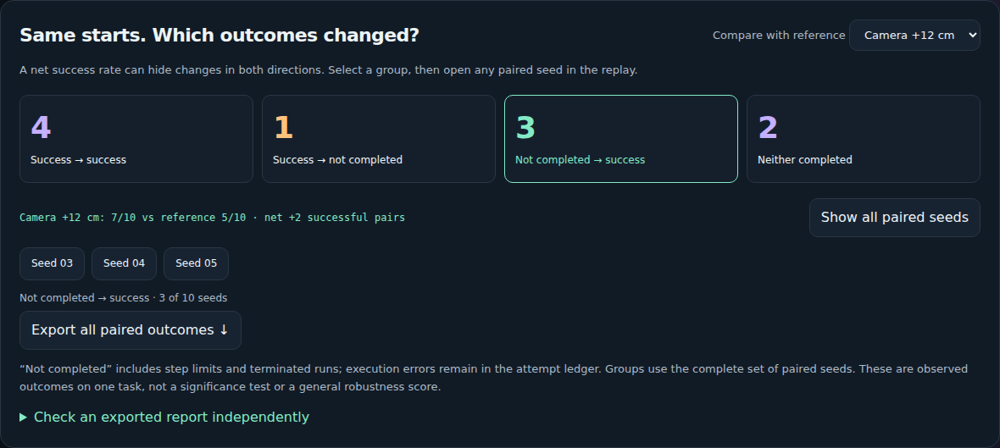</a>

**0.8.0 离线实验包**已包含这些复盘工具。下载 ZIP 和
[示例复盘 JSON](https://github.com/noteflowai/robot-reel/releases/download/v0.8.0/robot-reel-seed-09-review.json)，
按[快速上手说明](docs/offline-lab.md)解压打开即可回放，无需安装；使用同版本
wheel 还可独立执行命令行核验。

<sub>一个任务 × 三种原生场景条件 × 十个配对种子；每次固定最多 160 个动作、
8 秒仿真时间。保留全部试次，执行错误另记入尝试历史；提供实际控制量、测量状态、
分开的推理／仿真耗时及各条件置信区间。这是受控诊断实验，不是 LIBERO 官方榜单成绩。
预览按仿真时间播放；提前结束的运行明确标注停留在最后一个真实样本。</sub>

## 同一起点，不同结局

**Rerun 原生检查工作区。** 将一组配对压力实验的 6 路录制视频、三维末端轨迹、
实际动作和推理耗时放到同一时间轴。便携文件内嵌视频及原始 JSON，
导出后逐项读回，与源记录核对。

<a href="https://app.rerun.io/version/0.37.2/?url=https%3A%2F%2Fnoteflowai.github.io%2Frobot-reel%2Frerun%2Fseed-09.rrd">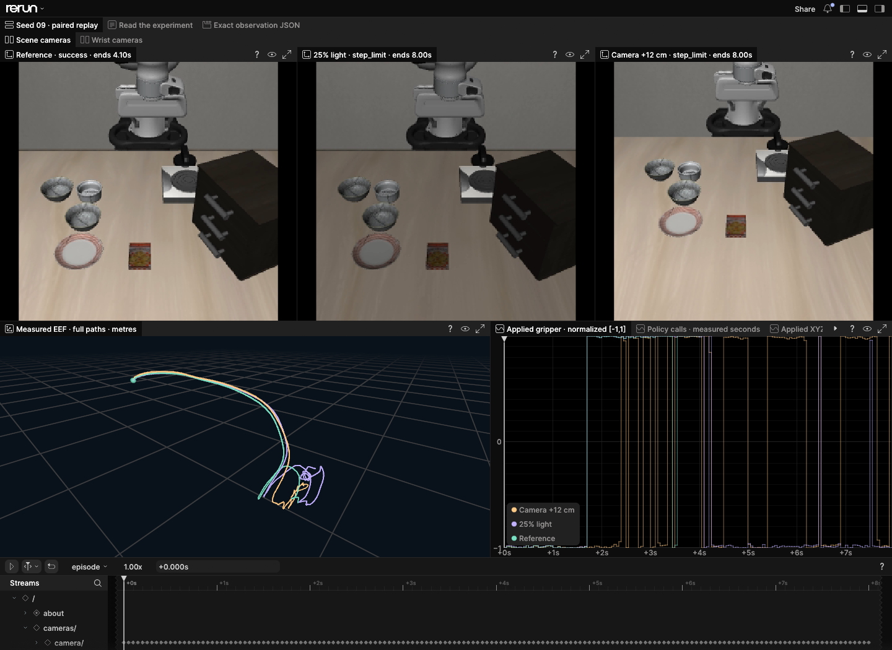</a>

**[打开 Rerun 工作区 ↗](https://app.rerun.io/version/0.37.2/?url=https%3A%2F%2Fnoteflowai.github.io%2Frobot-reel%2Frerun%2Fseed-09.rrd)** ·
[下载便携记录 ↓](https://noteflowai.github.io/robot-reel/rerun/seed-09.rrd) ·
[重建与核验](docs/telemetry.md#native-rerun-workspace)

<sub>精选第 9 组实验：参考条件成功，低光照和相机偏移达到步数上限。
405 个观测、41 次推理、6 段内嵌视频。完整统计仍以原始 30 次试验为准。
建议使用桌面浏览器；下载的文件可在本地 Rerun 0.37.2 中打开。</sub>

## 起点只差 0.05°，轨迹渐行渐远

**蝴蝶效应实验室。** 12 个隔离的 Newton 仿真世界从几乎相同的姿态出发，
实测轨迹逐渐展开成彩色的三维时间雕塑。拖动旋转，切换运动叠加视图，
找到微小的初始角度差异演变为 6.26 米摆端距离的那个时刻。

<a href="https://noteflowai.github.io/robot-reel/chaos/">
  <picture>
    <source media="(prefers-reduced-motion: reduce)" srcset="docs/chaos/poster.png">
    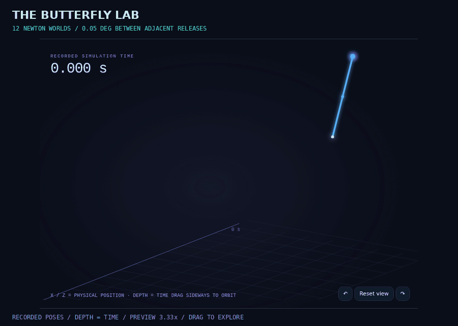
  </picture>
</a>

**[进入蝴蝶效应实验室 ↗](https://noteflowai.github.io/robot-reel/chaos/)** ·
[OpenUSD 场景 ↓](https://noteflowai.github.io/robot-reel/chaos/scene.usdc) ·
[离线实验包 ↓](https://noteflowai.github.io/robot-reel/chaos/experiment.zip) ·
[复现与检查](docs/chaos.md)

<sub>每个世界 601 个样本，全部 14,424 个刚体姿态通过 Blender 原生检查。
相邻释放角度相差 0.05°，整个扫描范围为 0.55°；最大记录距离发生在
12.5 秒的世界 04 与 01 之间，二者初始相差 0.15°。雕塑深度表示时间，
并非物理位移。首页预览以 3.33 倍速播放，交互回放默认原速。</sub>

## 同一段记录，两种视觉呈现

在 MuJoCo 原始仿真和 Blender 回放之间拖动对照。跳到记录中的接触时刻，
让两个视角一起逐帧前进，再把可编辑场景带进自己的工程。

<a href="https://noteflowai.github.io/robot-reel/remix/">
  <picture>
    <source media="(prefers-reduced-motion: reduce)" srcset="docs/remix/poster.png">
    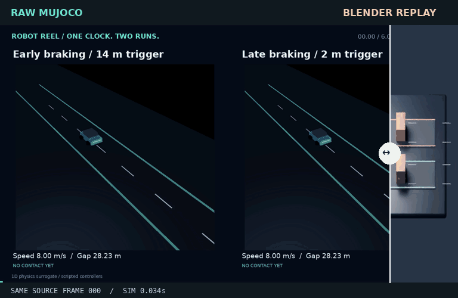
  </picture>
</a>

**[拖动体验前后对照 ↗](https://noteflowai.github.io/robot-reel/remix/)** ·
[样本如何保持一致](docs/remix.md) ·
[下载 Blender 场景](https://noteflowai.github.io/robot-reel/blender/replay.blend)

## 选一个场景，坐到第一排

<table>
<tr>
<td width="50%" valign="top">
<h3>01 / 一句指令 → 机械臂动作</h3>
<a href="https://noteflowai.github.io/robot-reel/vla/">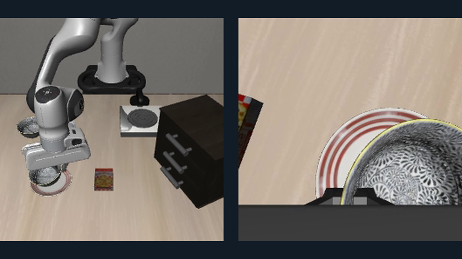</a>
<p>在 LIBERO 中实际运行 SmolVLA，让语言指令变成机械臂操作。两个相机视角、实测状态和每次执行的控制量，都可以同步检查。</p>
<p><strong>76 次动作 · 一次已完成的仿真任务</strong></p>
<p><a href="https://noteflowai.github.io/robot-reel/vla/">播放任务 ↗</a> · <a href="docs/vla.md">复现步骤</a> · <a href="https://noteflowai.github.io/robot-reel/vla/episode.zip">回放与证据包 ↓</a></p>
</td>
<td width="50%" valign="top">
<h3>02 / 创作意图 → Blender 成片</h3>
<a href="https://noteflowai.github.io/robot-reel/director/">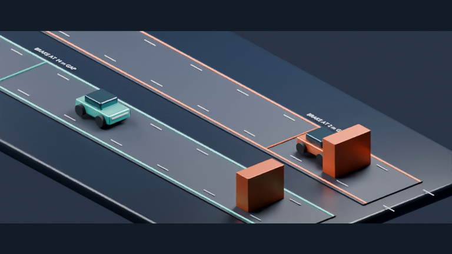</a>
<p>连接 MCP Agent，编排机位、字幕与慢动作，生成可编辑的 Blender 影片。每个成片帧都能追溯到原始录制中的样本。</p>
<p><strong>4 个机位 · 全部 180 个源样本保留</strong></p>
<p><a href="https://noteflowai.github.io/robot-reel/director/">查看成片 ↗</a> · <a href="docs/director.md">连接 Agent</a> · <a href="https://noteflowai.github.io/robot-reel/director/project.zip">Blender 工程 ↓</a></p>
</td>
</tr>
<tr>
<td width="50%" valign="top">
<h3>03 / 物理仿真 → 可编辑三维</h3>
<a href="https://noteflowai.github.io/robot-reel/newton/">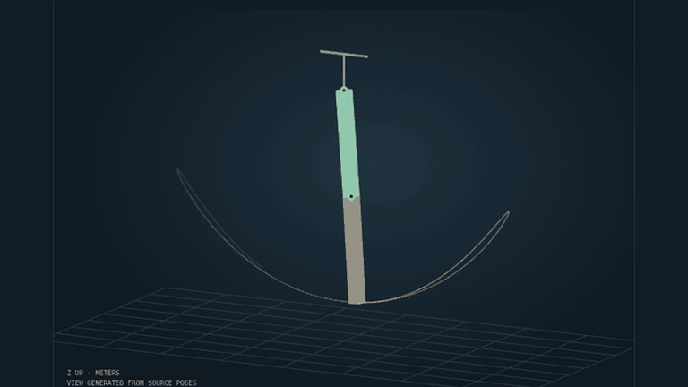</a>
<p>在 CPU 上录制 Newton 物理过程，在浏览器里检查实测姿态，再将带动画的 OpenUSD 场景带进 Blender，继续布光、编辑与渲染。</p>
<p><strong>181 个源样本 · 362 个已检查的刚体变换</strong></p>
<p><a href="https://noteflowai.github.io/robot-reel/newton/">检查物理过程 ↗</a> · <a href="docs/newton.md">构建场景</a> · <a href="https://noteflowai.github.io/robot-reel/newton/scene.usda">OpenUSD ↓</a></p>
</td>
<td width="50%" valign="top">
<h3>04 / 小机器人，学习得到的步态</h3>
<a href="https://noteflowai.github.io/robot-reel/microduck/">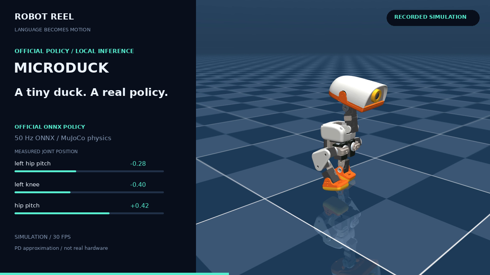</a>
<p>观看 Pollen Robotics 的 Microduck 运行官方 ONNX 步行策略。检查关节目标、实际响应与机身运动，也可以比较两种速度指令下的表现。</p>
<p><strong>50 Hz 策略 · 14 个关节的目标与响应</strong></p>
<p><a href="https://noteflowai.github.io/robot-reel/microduck/">认识 Microduck ↗</a> · <a href="https://noteflowai.github.io/robot-reel/compare/microduck/">比较速度</a> · <a href="docs/recording.zh-CN.md">自己录制</a></p>
</td>
</tr>
</table>

**更多场景：** [早制动与晚制动对照](https://noteflowai.github.io/robot-reel/compare/braking/) ·
[SO-100 机械臂工作室](https://noteflowai.github.io/robot-reel/studio/) ·
[可编辑的制动场景](https://noteflowai.github.io/robot-reel/blender/)

## 影片背后，运行记录也一起保留

| 观看 | 检查 | 复用 |
| --- | --- | --- |
| 浏览器回放、同步视角、镜头导航与单帧分享。 | 执行动作、实测姿态、记录到的结果与源版本。 | 离线回放包、MP4、JSON 轨迹、Blender 工程与 OpenUSD 场景。 |

**让证据跟着演示一起交付。** 校验器检查文件哈希、时间戳、帧映射和结果一致性。
Blender 原生检查覆盖导演影片中的全部 420 个车辆状态，以及 Newton 导入后的全部
362 个刚体变换。[导演工程检查](docs/director/animation-check.json) ·
[Newton 检查](docs/newton/blender-check.json)。

浏览器展示已录制的仿真。VLA 示例是一次固定种子的运行，播放时省略推理等待；
新的导演需求由你连接的 Agent 解读，并重新渲染。Microduck 使用 XML PD 执行器回退方案。
[适用范围、来源与资产条款](THIRD_PARTY.md)。

## 与同类项目的区别

Robot Reel 不是仿真器、训练框架或基准测试。它位于这些工具之后：
录下一次运行，校验轨迹，再把它变成可观看、可检查、可复用的东西。

| | 侧重 | Robot Reel 的位置 |
| --- | --- | --- |
| [LeRobot](https://github.com/huggingface/lerobot) | 真实与仿真机器人的数据集、策略与训练 | 运行 LeRobot 策略（SmolVLA），保留每个执行动作、双相机画面以及硬件与耗时记录，做成回放 |
| [MuJoCo Playground](https://github.com/google-deepmind/mujoco_playground)、[Isaac Lab](https://github.com/isaac-sim/IsaacLab) | GPU 规模的环境与强化学习训练 | 取仿真器的一次运行，让它可检查、可对照、可编辑 |
| [Genesis](https://github.com/Genesis-Embodied-AI/Genesis)、[Newton](https://github.com/newton-physics/newton) | 物理引擎 | 在 CPU 上录制 Newton，把实测运动导出为带动画的 OpenUSD 场景，并用 Blender 原生检查 |
| Rerun、Foxglove | 通用遥测查看器 | 发布自包含 HTML 回放、MCAP 遥测，以及内嵌视频并经过核验的 Rerun 原生工作区 |

独特之处在于这条链：哈希校验的轨迹、同一时钟上的配对对照、
由 MCP Agent 根据录制指挥 Blender 成片，以及关键帧能映射回原始样本的三维场景。

## 构建你自己的场景

选择你想实际构建的流程：

| 我想…… | 从这里开始 |
| --- | --- |
| 用 GPU 运行配对策略压力实验 | [CUDA 环境、固定实验与证据校验](docs/stress.md) |
| 在本地运行 SmolVLA | [独立 CPU 环境与固定模型版本](docs/vla.md) |
| 让 Agent 为实验编排成片 | [MCP 配置与 Blender 构建／渲染](docs/director.md) |
| 把真实物理过程导入三维软件 | [Newton → OpenUSD → Blender](docs/newton.md) |
| 探索仿真参数扫描 | [蝴蝶效应实验室 → 12 个隔离世界](docs/chaos.md) |
| 录制 Microduck、制动或机械臂 | [录制场景与运行环境](docs/recording.zh-CN.md) |
| 对照两次运行的结果 | [比较约定与 CLI](docs/comparison.md) |

## 一起做下一个场景

欢迎带着可运行的回放和可检查的源数据来贡献：新的仿真适配器、实测策略对比、
更易用的播放器，以及可编辑的三维导出。
[参与贡献](CONTRIBUTING.md) · [开发与检查](docs/recording.zh-CN.md#开发) ·
[Issues](https://github.com/noteflowai/robot-reel/issues)。

基于 [LeRobot](https://github.com/huggingface/lerobot)、
[MuJoCo](https://github.com/google-deepmind/mujoco)、
[Newton](https://github.com/newton-physics/newton)、
[Blender](https://www.blender.org)、
[OpenUSD](https://github.com/PixarAnimationStudios/OpenUSD)、
[Strands Robots](https://github.com/strands-labs/robots) 与
[Pollen Robotics](https://github.com/pollen-robotics/microduck) 构建。

<sub>录制代码采用 Apache-2.0。VLA 画面保留<a href="licenses/VLA-MEDIA-NOTICE.txt">上游署名与资产条款</a>；Microduck 媒体保留其<a href="docs/microduck/media/MICRODUCK-MEDIA-NOTICE.txt">非商业／相同方式共享条款</a>。封面预览附有<a href="docs/showcase/manifest.json">源帧映射</a>与<a href="docs/showcase/NOTICE.txt">媒体说明</a>。本项目独立维护，不代表上游官方背书。</sub>
