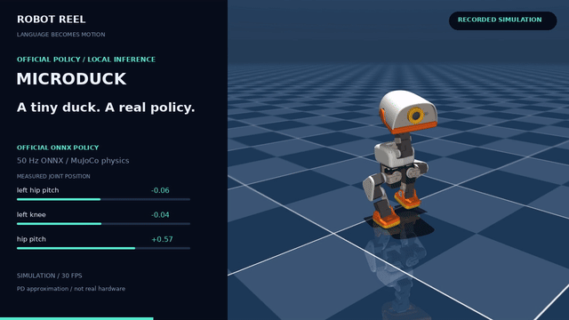
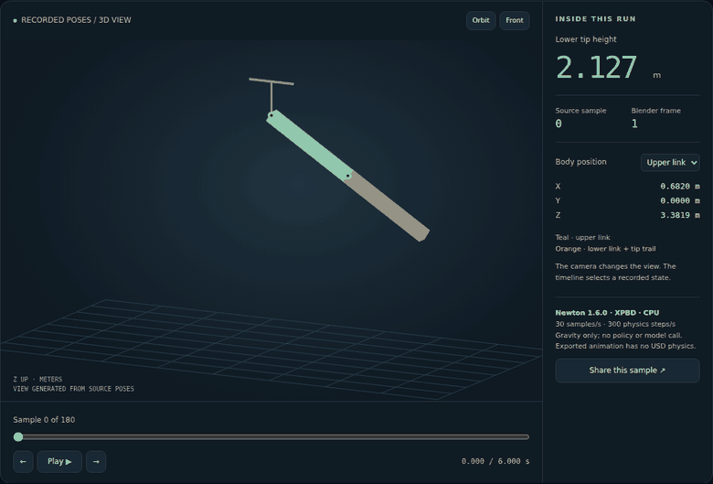
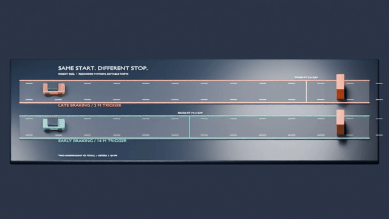

# Robot Reel

**看机器人，也看清每一步。**

把物理 AI 仿真录制成可分享的视频，同时保留可交互的逐帧动作记录。
可以运行 Microduck 官方策略、对比两种制动控制器，或让 Strands Agent
控制机械臂。回放直接在浏览器里打开，观看不需要账号，也不需要安装。
也可以把录制轨迹带进 Blender，或将 Newton 物理仿真导出为带动画的 OpenUSD 场景。

[**试试 Microduck →**](https://noteflowai.github.io/robot-reel/) ·
[**对比制动 →**](https://noteflowai.github.io/robot-reel/braking/) ·
[**检查 Agent 机械臂 →**](https://noteflowai.github.io/robot-reel/studio/) ·
[**在 Blender 中打开 →**](https://noteflowai.github.io/robot-reel/blender/) ·
[**Newton → USD → Blender →**](https://noteflowai.github.io/robot-reel/newton/) ·
[English](README.md)



[下载视频与证据包](https://github.com/noteflowai/robot-reel/releases/tag/v0.3.0)

## 新增：Newton → OpenUSD → Blender

**运行一次物理仿真，分享每一个姿态。** 在 CPU 上录制真实的 Newton 1.6
双摆仿真，在浏览器里检查实测的 3D 姿态，再将同一段动画导入 Blender。
无需 GPU、API 密钥或额外下载的场景资产。

[**检查 Newton 回放并下载 USD 场景 →**](https://noteflowai.github.io/robot-reel/newton/)



```bash
pip install -e '.[newton]'
robot-reel newton --output artifacts/newton
robot-reel newton --output artifacts/newton --verify --check-usd
```

打开 `artifacts/newton/index.html`，或将 Blender 设置为 **30 fps** 后导入
`scene.usda`。六秒演示包含从仿真时刻零开始的 181 个样本，全部 **362 个刚体
变换**均通过 Blender 5.2.1 实际导入后的检查。这里导出的是刚体展示动画；
浏览器和 Blender 都在回放已记录的姿态。
[复现步骤及 Blender 导入检查](docs/newton.md)。

## 新增：把录制结果带进 Blender

**保留运动，重新设计场景。** 将已验证的制动对照导出为可编辑的 Blender
场景：两个机位、程序化材质、来自原始样本的关键帧，以及速度／间距／接触数据。

[**观看 Blender 回放并下载工程 →**](https://noteflowai.github.io/robot-reel/blender/)



```bash
# 使用仓库内已有的制动对照，无需安装录制依赖。
python3 -m robot_reel.cli blender docs/compare/braking --output artifacts/blender
blender --background --python artifacts/blender/build_scene.py -- \
  --bundle artifacts/blender --output artifacts/blender/replay.blend
```

已在 Blender 5.2.1 LTS 验证。车辆位置逐帧来自原始记录；这是对一维实验的
风格化回放，没有在 Blender 中重新做物理仿真。
[复现步骤及全部 360 个车辆状态的验证方法](docs/blender.md)。

## 新增：两次运行，同一时钟

[**对比 Microduck 速度 →**](https://noteflowai.github.io/robot-reel/compare/microduck/) ·
[**对比制动时机 →**](https://noteflowai.github.io/robot-reel/compare/braking/)

同步播放的原始视频、共享的逐帧步进、实测通道曲线，以及可下载的源轨迹。
CLI 会校验时间戳、模型配置和引擎版本；遇到不匹配的录制会直接拒绝，而不是
悄悄裁剪。这些是单次试验，不是统计意义上的基准测试。
[复现这些对比](docs/comparison.md)。

## MuJoCo 录制场景

| 场景 | 实际运行的内容 | 可以检查的数据 |
| --- | --- | --- |
| **Microduck** | Pollen Robotics 官方 ONNX 步行策略，50 Hz，运行在 CPU MuJoCo 上 | 14 个关节的目标值与响应、每一次策略输出、机身位移、固定的策略校验和 |
| **制动** | 同一个一维刚体车辆替代模型下的两套脚本控制器 | 速度、障碍间距、制动力、记录到的接触；早制动与晚制动对比 |
| **Studio** | SO-100 位置执行器；可选的实时 Strands Agent。G1 是脚本编排的运动学片段 | 四次机械臂动作、末端误差、资产定义的 home 姿态、逐帧轨迹 |

所有画面都来自仿真器。标题和遥测数据由代码绘制，配乐为原创程序合成。
回放支持镜头跳转、单帧步进、关节选择、实测/参考曲线，以及按时间戳分享。

**局限是公开的：** Microduck 使用上游 XML 里的 PD 执行器回退方案，而不是
官方部署所用的 BAM 电机模型。制动场景是一个玩具级纵向场景，既不是 CARLA、
AlpaSim，也不是 Alpamayo 推理运行或道路安全验证。G1 不展示行走，也没有
学习得到的平衡策略。

## 快速开始

需要 Python 3.12+ 和 OpenGL。实测环境为 Linux / NVIDIA L40S / EGL。

```bash
git clone https://github.com/noteflowai/robot-reel.git
cd robot-reel
python3.12 -m venv .venv
source .venv/bin/activate
pip install -e '.[microduck]'

# 官方预训练的 Microduck 策略；不需要训练，也不需要模型服务账号。
robot-reel --pack microduck --output artifacts/duck
python -m robot_reel.verify artifacts/duck
```

直接打开 `artifacts/duck/index.html`。首次运行会下载固定版本的上游模型资产
和策略。策略在 CPU 上运行；渲染需要 OpenGL。用 `ROBOT_REEL_CACHE` 指定
下载缓存目录。

Microduck 模型资产在上游被标注为 **Creative Commons BY-SA-NC**（上游 README
未说明版本号）。相关画面保留这些资产条款与署名要求。我们的录制代码是
Apache-2.0，不会对 Pollen 的模型重新授权。详见
[THIRD_PARTY.md](THIRD_PARTY.md)。

其他场景只需要 `pip install -e .`：

```bash
# 初始条件完全相同的两次制动运行。
robot-reel --pack braking --output artifacts/braking

# 无需凭据的机械臂 + 人形演示。
robot-reel --output artifacts/studio

# 你自己的四镜头机械臂计划；最后一镜回到模型定义的 home 姿态。
robot-reel --shots examples/close-up.json --output artifacts/my-film
```

浏览器里的计划编辑器会导出一个可用于 `--shots` 的 `shots.json`。编辑这个计划
不会修改或重新仿真当前正在播放的视频。未知关节、非有限的目标值、超出范围的
目标值以及不支持的计划字段都会被拒绝。前三个镜头会保留未指定的关节；第四个
镜头必须使用 `"home": true`。

Linux 默认使用 EGL；安装系统的 OSMesa 库后可以用 `MUJOCO_GL=osmesa` 走软件
渲染。macOS 默认使用 `glfw`，但还没有纳入实测平台矩阵。

## 输出

每个 MuJoCo 场景会产生两个 H.264/AAC 视频、一个可交互的 HTML 回放、原始仿真录像、
逐帧 JSON 轨迹、一张封面图和一份 SHA-256 清单。Microduck 还会记录全部 50 Hz
策略动作及其策略/模型版本号。
独立的 Newton 命令生成 HTML 姿态回放、JSON 轨迹、带动画的 USD 场景和校验
清单，不渲染 MP4。

| 场景 | 仿真画面 | 成片 |
| --- | --- | --- |
| Microduck | 10 秒 / 300 帧 | 15 秒 |
| 制动 | 2 × 6 秒 / 360 帧 | 17 秒 |
| Studio | 16 秒机械臂 + 10 秒 G1 / 780 帧 | 31 秒 |

横版为 1280×720，竖版为 720×1280，均为 30 fps。可以直接分享 MP4，或者把
`index.html` 与视频放在一起，用于本地交互回放。

```bash
# 重新剪辑已有的录制，包括 Microduck 或制动场景。
robot-reel --render-only --output artifacts/duck

# 为已有的兼容证据包加上最新的回放界面。
python -m robot_reel.viewer artifacts/duck
```

## 可选：让 Agent 指挥机械臂

配置 AWS SDK 凭据，并选择一个你可以访问的 Bedrock 模型或推理配置。这会产生
模型调用费用：

```bash
robot-reel --agent --model YOUR_BEDROCK_MODEL_OR_INFERENCE_PROFILE \
  --region us-west-2 --output artifacts/agent-film
```

Agent 会先检查关节限位和 home 姿态，然后给出四次受约束的动作。它的提示词和
回复都会被保存。推理等待时间不进入视频，动作帧保持原有顺序。这是一个有边界的
演示，不是开放式的自主规划。

## 是证据，不是认证

校验器要求每个场景的原始视频与轨迹、以及两个成片都有哈希值。它会检查帧序、
数值有限性、来源标签、机械臂动作与画面帧的一致性、策略步与画面帧的一致性，
以及制动接触汇总的一致性。机械臂末端误差和 home 误差必须落在 0.05 弧度的
演示容差内。

哈希只能检测相对于清单的改动。它们不是签名，不能证明独立的真实性，也不能
认证物理安全或通用的策略能力。驾驶相关的结论只适用于文档中描述的替代模型。

## 为什么做这个

[Microduck](https://github.com/pollen-robotics/microduck) 和
[Microduck RL](https://github.com/pollen-robotics/microduck_rl) 提供了机器人和
学习得到的行为。[Strands Robots](https://github.com/strands-labs/robots) 提供
Agent 与机器人的集成。Robot Reel 专注于**把一次运行变成人们可以观看、检查和
复现的东西**。

汽车场景只是记录可比较结果的一个小起点。关于它与 Alpamayo、AlpaSim、CARLA
的关系，以及哪些还没有集成，见[汽车集成说明](docs/automotive.md)。

## 开发

```bash
# 轨迹、计划和导出测试只需要 Python 标准库。
python3 -m unittest discover -s tests -v
# 进行录制／渲染开发时，在独立环境中安装运行依赖。
python3 -m venv .venv
source .venv/bin/activate
python -m pip install -e .
npm ci
npx playwright install chromium
npm test
```

Python 测试覆盖计划拒绝、证据一致性与 Blender 导出数据对应关系。导入校验函数
无需 `imageio_ffmpeg`、MuJoCo 或 NumPy；CI 也会在禁用第三方包的环境中运行测试。
浏览器测试覆盖跳转、步进、下载、
移动端布局、本地文件播放和字幕转义。真实录制的冒烟测试需要 OpenGL 和已下载
的模型资产。Studio 适配器使用了 Strands Robots 的私有字段，并固定在 0.5.1 版本。

参见 [CONTRIBUTING.md](CONTRIBUTING.md)。有价值的贡献包括：公共后端适配器、
可测量的策略对比，以及真实 AlpaSim/CARLA 运行的导入适配器。不要把计划中的
集成描述成已经实现的功能。
