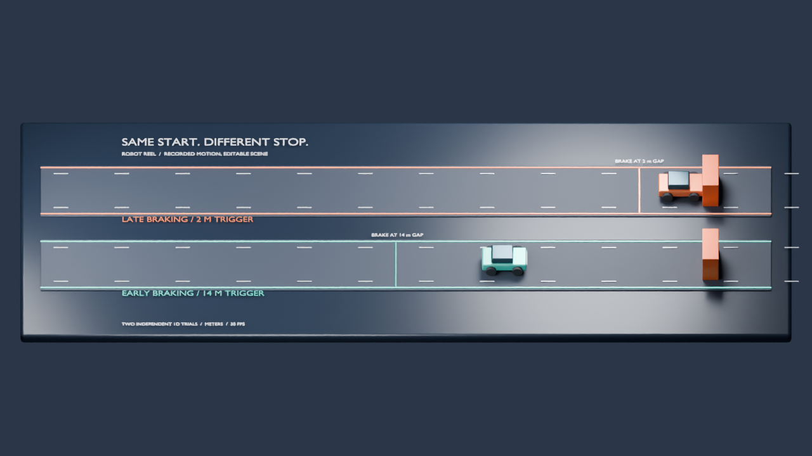

# Recorded motion, editable Blender scene

Robot Reel exports the verified braking pack into a standalone Blender project:
two independent vehicle trials, source-driven keyframes, two cameras, procedural
materials, timeline markers and animated speed/gap/contact properties.

[Watch and download the demo](blender/index.html).



## Try it without recording anything

From this repository checkout, Python 3.12+ can export and verify the included
comparison without installing MuJoCo, FFmpeg, NumPy or Blender:

```bash
python3 -m robot_reel.cli blender docs/compare/braking --output artifacts/blender
python3 -m robot_reel.cli blender artifacts/blender --verify
```

Use **Blender 5.2 LTS** to create the editable project. The importer was tested
with Blender 5.2.1 LTS; other Blender versions are not part of the tested matrix.
Launch a fresh Blender process: the builder replaces the current scene.

```bash
blender --background --python artifacts/blender/build_scene.py -- \
  --bundle artifacts/blender --output artifacts/blender/replay.blend
```

Open `replay.blend`. Scrub frames 1–180, switch between the Overview and Impact
cameras, change the lights, or restyle the procedural objects. Each
`left / recorded vehicle` and `right / recorded vehicle` object has animated
`source_frame`, `sim_time_s`, `speed_mps`, `gap_m` and `contact_recorded` properties.
Timeline markers identify the first recorded braking and contact frames.

No add-on, asset download, service account or AI model call is required.

## Record your own pair

Install the project in a virtual environment before recording:

```bash
python3 -m venv .venv
source .venv/bin/activate
python -m pip install -e .
robot-reel --pack braking --output artifacts/braking
robot-reel blender artifacts/braking --output artifacts/my-blender
```

The exporter accepts a full braking capture or a verified braking comparison.
It checks the input bundle before copying traces. The export retains the original
trace bytes and source manifests; it does not duplicate the raw videos.

## Render and check

The same builder can render a PNG sequence or a poster. Choose a fresh `.blend`
filename; existing projects are never overwritten:

```bash
blender --background --python artifacts/blender/build_scene.py -- \
  --bundle artifacts/blender --output artifacts/blender/render.blend \
  --render-frames artifacts/blender/frames --poster artifacts/blender/poster.png

blender --background --python scripts/check_blender.py -- \
  --bundle artifacts/blender --blend artifacts/blender/render.blend \
  --report artifacts/blender/animation-check.json
```

The check loads the saved `.blend` and compares all 360 vehicle samples and their
animated telemetry against `scene.json`. It also tests held positions halfway
between samples. The supplied scene uses constant interpolation and no motion
blur, so Blender does not invent an intermediate trajectory. Stored Blender
locations use floating-point precision; the check allows 0.00001 m position error.
Changing camera, lighting or material does not require changing the vehicle curves.

Blender frame 1 maps to source frame 0. The first physical sample occurs after
the first simulation step interval; a fictitious time-zero pose is not added.
The encoded replay clock begins at zero, while the simulation timestamp remains
available separately.

## Scope

This is a stylized replay of a **1D MuJoCo surrogate**. The two roads are display
offsets of separately recorded trials. Decorative wheels, materials and lights
are illustrative. Blender performs no rigid-body simulation, and this is not
an autonomous-driving or safety evaluation.

Only the braking pack is supported. The older robot traces do not contain enough
complete root-pose and geometry information for a faithful general robot importer.
This release is not an integration with Blender MCP, BlenderProc or Blender's
node-based physics.

The scene is a useful starting point for Blender artists or scene-editing agents:
restyle a real recorded outcome while keeping a checkable motion source.
Hashes detect changes relative to their manifests; they are not signatures.
After editing, rerun the checks if you intend to retain the original motion claim.

All demo geometry is generated by Robot Reel's Apache-2.0 code. No Microduck or
other third-party robot meshes are included in this scene.

## Rebuild the published page

`scripts/render_blender_preview.py` renders every frame of the checked project
with CPU Cycles and a faster denoiser. The default 75% scale produces a 960×540
preview from the landscape project; it does not change the saved `.blend`.

```bash
blender --background --python scripts/check_blender.py -- \
  --bundle artifacts/blender --blend artifacts/blender/replay.blend \
  --report artifacts/blender/animation-check.json

blender --background --python scripts/render_blender_preview.py -- \
  --blend artifacts/blender/replay.blend --frames artifacts/blender/frames

# With FFmpeg installed, encode the original 30 fps sequence.
ffmpeg -framerate 30 -i artifacts/blender/frames/frame-%04d.png \
  -c:v libx264 -crf 20 -pix_fmt yuv420p -movflags +faststart \
  artifacts/blender/replay.mp4

python scripts/build_blender_site.py --bundle artifacts/blender \
  --video artifacts/blender/replay.mp4 --poster artifacts/blender/poster.png
```

Check the exact `replay.blend` being published, even if another render project was
checked earlier; the report records the file's hash.
The page builder checks the project's and source scene's report hashes plus the
video's frame count, duration and frame rate. It packages the source JSON, builder,
manifests, `.blend` and report into a small downloadable ZIP. The page's transport
and telemetry also work when opened as a local file.
