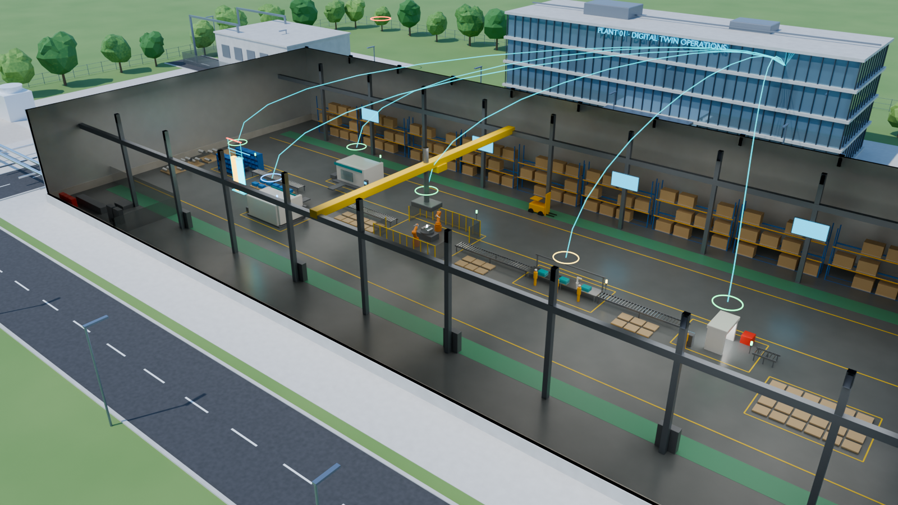

# Factory Twin Lab: a closed-loop digital twin of a factory and campus

[Open the lab](https://noteflowai.github.io/robot-reel/factory-twin/) ·
[Offline experiment](https://noteflowai.github.io/robot-reel/factory-twin/experiment.zip) ·
[Blender + OpenUSD projects](https://github.com/noteflowai/robot-reel/releases/latest/download/factory-twin-blender.zip) ·
[Methods and limits](../examples/factory-twin/METHODS.md)



**[Watch the 24-second flythrough](https://noteflowai.github.io/robot-reel/factory-twin/film.mp4)**
(Cycles, rendered at 1080p, encoded at 1600 × 900). The camera path is cinematography; every film frame shows one
recorded sample of the closed-loop shift, and [`film.json`](factory-twin/film.json)
lists that mapping, the camera keys and the hash of the checked Blender project.

A simulated plant (a six-station production line, three AMRs, hall climate and
campus energy) sends noisy, lossy, delayed telemetry to a digital twin. The twin
completes the loop:

| Step | What the twin does | Where to see it |
| --- | --- | --- |
| Sense | Receives PLC, CNC, energy, climate and AMR packets every 5 s; 2–3 % are lost, all arrive 5 s late | `samples.telemetry` in each trace |
| Sync | Mirrors station states, buffers and AMR poses from the packets it received | Dashed rings and cyan ghosts in the 3D view |
| Estimate | Tracks hidden CNC 2 spindle wear and wear rate with an extended Kalman filter on vibration | Wear chart: amber truth vs. cyan estimate ±2σ |
| Predict | Forward-simulates its own line model for 90 min under 14 maintenance plans; forecasts the 15-minute billed demand | Decision log: evidence → prediction |
| Decide | Schedules service, derates feed, raises the hall setpoint and caps EV charging | Decision log and 3D beacons |
| Act | Closed mode: commands reach the plant after 5 s. Shadow mode: logged only | Toggle *Closed loop / Shadow twin* |

Both modes of a pair share every disturbance and every sensor-noise sample, so
the difference between them is the effect of closing the loop in this model.

## Results

Featured shift (seed 10, 10:00–13:00):

| | Shadow twin (advice only) | Closed loop |
| --- | ---: | ---: |
| Good parts | 182 | 202 |
| CNC 2 spindle failures | 1 (45 min repair) | 0 (one 15 min planned service) |
| Scrap | 10 | 2 |
| Peak 15-min demand | 560.3 kW | 466.3 kW |
| Billing intervals over 520 kW | 2 | 0 |
| Max hall temperature | 24.2 °C | 24.8 °C |

Across 12 paired seeds, the closed loop had **0 spindle failures (shadow: 11)**
and **0 billing intervals over the limit (shadow: 8)**. Good parts rose in 10
pairs and fell in 2 (mean +11.1, range −3 to +20): where a failure would have
come late or not at all within the shift, early service costs output. Exact
values are in `seeds.json`; `--verify --all-seeds` re-executes them.

The plant is illustrative: parameters and cost weights were chosen for the
demonstration, not calibrated to a real site. Treat the numbers as a check that
the loop works as described, not as an estimate of savings.

## The 3D model

`scripts/build_factory_twin_blender.py` models the whole campus procedurally in
Blender 5.2 LTS with no downloaded assets: a 100 × 44 m assembly hall (steel
frame, crane, roof monitors, racking, cutaway roof and south wall), CNC
enclosures with spindles, a fenced weld cell with two six-axis robots, assembly
benches with cobots and operators, an inspection portal, conveyors, buffers and
pallets, AMRs, a warehouse with racks and trucks, a four-storey office with the
twin operations center, an energy center with transformers, chillers, cooling
towers and a water tower, a solar carport with EV chargers, roads, cars and
trees. Materials are node-based (ribbed cladding, PV cells, noise-driven
concrete, asphalt and foliage).

The recorded samples drive constant-interpolated keyframes: station beacons,
twin status rings, spindles, weld robot joints, crates in every buffer slot,
AMR poses and payloads, twin ghost AMRs, the wear gauge (truth, estimate and
2σ band), the grid import column, EV charger rings, rooftop units and the sun
dimming under the recorded cloud. Frame `k + 1` shows sample `k` (5 s of plant
time) at 30 fps. Blender performs no physics.

## Where to get it

| Channel | What it contains |
| --- | --- |
| [Project site](https://noteflowai.github.io/robot-reel/factory-twin/) | Interactive lab, renders and the flythrough film |
| [Hugging Face Space](https://huggingface.co/spaces/glayguo/robot-reel/tree/main/factory-twin) | The same lab, hosted beside the other experiments |
| [GitHub Release](https://github.com/noteflowai/robot-reel/releases/latest) | `robot-reel-factory-twin-experiment.zip` (offline lab) and `factory-twin-blender.zip` (Blender + OpenUSD) |
| [Hugging Face Dataset](https://huggingface.co/datasets/glayguo/robot-reel-factory-twin) | `pairs`, `seeds`, `samples` and `decisions` tables for `load_dataset` (`scripts/build_hf_factory_twin.py`) |
| [PyPI](https://pypi.org/project/robot-reel/) | `robot-reel factory-twin --verify` and `--export-from` |

The Blender archive is stored at a pinned revision of the
[`glayguo/noteflow-research-pilots`](https://huggingface.co/datasets/glayguo/noteflow-research-pilots)
dataset (see `requirements/research-release-assets.json`); release builds fetch
it, check every project and USD hash against `blender-check.json` and list it in
`SHA256SUMS`. Releases from v0.18.0 carry the same bytes, SHA-256
`e205a6e633784898e7db7b27ede00b572056c116f4a5cd62153a8ac869788baf`. Check any copy with:

```bash
python3 scripts/package_factory_twin_blender.py --verify factory-twin-blender.zip
python3 scripts/build_factory_twin_film.py --verify docs/factory-twin
```

## Reproduce

```bash
# Verify the published lab (standard library only)
robot-reel factory-twin --output docs/factory-twin --verify
robot-reel factory-twin --output docs/factory-twin --verify --all-seeds

# Rebuild everything: simulate, model, check, render, publish (Blender 5.2 LTS)
python3 scripts/build_factory_twin.py --output docs/factory-twin \
  --work artifacts/factory-twin --blender /path/to/blender --preview

# Render and encode the flythrough film (about 50 minutes on an L40S)
blender --background --python scripts/render_factory_twin_film.py -- \
  --blend artifacts/factory-twin/factory-twin-closed.blend --output artifacts/factory-twin/film \
  --samples 40 --width 1920 --height 1080
python3 scripts/build_factory_twin_film.py --frames artifacts/factory-twin/film \
  --blend artifacts/factory-twin/factory-twin-closed.blend --output docs/factory-twin

# Or run the Blender stages by hand
blender --background --factory-startup --python scripts/build_factory_twin_blender.py -- \
  --lab docs/factory-twin/lab.json --mode closed --output factory-twin-closed.blend
blender --background --factory-startup --python scripts/check_factory_twin_blender.py -- \
  --lab docs/factory-twin/lab.json --blend factory-twin-closed.blend --mode closed \
  --usd factory-twin-closed.usdc --report check-closed.json
blender --background --python scripts/render_factory_twin.py -- \
  --blend factory-twin-closed.blend --view hall --frames 361 --output renders
```

The check compares all 313 animated channels at all 2,161 frames with
`lab.json` (676,393 values per mode), re-derives AMR positions, visible crates,
beacon colors and the wear gauge independently, confirms values hold between
frames, then exports OpenUSD and reads every animated prim's world transform
back with `pxr` at every time code. The receipt is `blender-check.json`.

Tested with Blender 5.2.1 LTS on Linux. Rendering used Cycles with OptiX on an
NVIDIA L40S; any Cycles device works, only more slowly.
