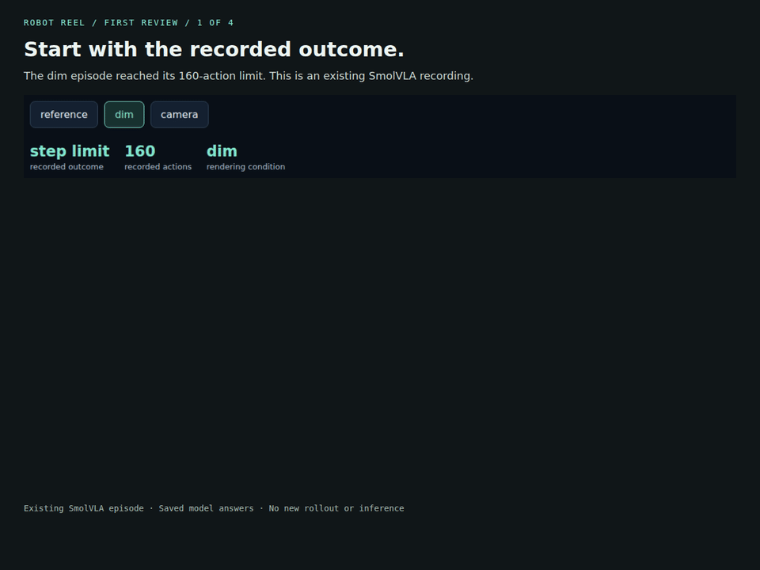

# Your first model-claim review

Download the original robot evidence, take one preserved model answer, and check
its concrete claims. You do not need a GPU, model account, repository checkout
or a new simulation.

[Open the recorded review](https://noteflowai.github.io/robot-reel/model-review/index.html) ·
[30-second walkthrough](assets/ai-first-review.mp4)



## 1. Install the published package

Use Python 3.12+ and a new directory. These commands use Bash on Linux/macOS.
The standard installation also includes Robot Reel's simulation dependencies;
this walkthrough only runs the offline review command.

```sh
mkdir robot-claim-first-review && cd robot-claim-first-review
python3 -m venv .venv
.venv/bin/python -m pip install robot-reel==0.16.0
```

## 2. Download the immutable evidence

The archive contains three existing SmolVLA episodes, both original camera
recordings, traces, exact sampled images, six model answers and the offline page.
The script checks the release's SHA-256 before extraction.

```sh
.venv/bin/python - <<'PY'
import hashlib
import io
from pathlib import Path
from urllib.request import urlopen
from zipfile import ZipFile

url = "https://github.com/noteflowai/robot-reel/releases/download/v0.16.0/robot-reel-model-review.zip"
expected = "7691e06219d840dab3a19f3e411ad513ed69f00e3c69437e046b1f032cc601b3"
with urlopen(url, timeout=60) as response:
    data = response.read()
if hashlib.sha256(data).hexdigest() != expected:
    raise SystemExit("Archive checksum differs; do not extract it.")
Path("recorded-review").mkdir()
with Path("review.zip").open("xb") as output:
    output.write(data)
with ZipFile(io.BytesIO(data)) as archive:
    archive.extractall("recorded-review")
PY
```

Open `recorded-review/index.html`. Select **dim**, play the paired cameras, and
compare **Images only** with **Images + record**. These are saved simulations,
not a new policy test. One answer was generated for each mode and episode.

## 3. Check the exact model answer

Extract the `text` field without editing or cleaning the answer:

```sh
.venv/bin/python - <<'PY'
import json
from pathlib import Path

source = Path("recorded-review/recorded/episode-b-with-record-17.json")
record = json.loads(source.read_text())
with Path("claims.json").open("x") as output:
    output.write(record["text"])
PY
.venv/bin/robot-reel review-claims \
  recorded-review/media/episode-b/trace.json claims.json --output my-review.json
```

**Expected exit: 0.** The outcome (`step_limit`), action count (`160`) and cited
frame labels match the supplied trace. The report binds both input files by
SHA-256 and keeps `"explanation_status": "not_assessed"`.

The answer was given the outcome record. Matching it is record reading, not
independent discovery of failure. A frame label's existence does not establish
that the image supports the explanation or proves a physical cause.

## 4. Keep a real format failure visible

The images-only answer wraps its JSON in Markdown despite the requested format.
Pass its exact text to the same checker:

```sh
.venv/bin/python - <<'PY'
import json
from pathlib import Path

source = Path("recorded-review/recorded/episode-b-images-only-17.json")
record = json.loads(source.read_text())
with Path("images-only.json").open("x") as output:
    output.write(record["text"])
PY
.venv/bin/robot-reel review-claims \
  recorded-review/media/episode-b/trace.json images-only.json
```

**Expected exit: 2**, because the answer is not a strict JSON document. Do not
strip the fences and report the cleaned answer as the model's original result.
The browser extracts the fenced content only for readable display and keeps the
format failure visible.

For a valid claim document, exit 1 instead means a contradicted or unassessed
claim. Existing output reports are never overwritten. See
[the schema, method and full scope](model-review.md) before reviewing another trace.

## Walkthrough transcript

The video contains four annotated screenshots of the actual recorded viewer:
the outcome record, original cameras, images-only format failure and the
record-supplied fact checks. It has no audio, new simulation or inference.
[Captions](assets/ai-first-review.vtt) and
[source/file hashes](assets/ai-first-review-media.json) accompany it.
Rebuild with `scripts/capture_ai_walkthrough.cjs` against the recorded viewer.
Keep the archive's `NOTICE.txt` with redistributed robot media.

## 中文快速开始

从已发布的 `robot-reel==0.16.0` 和固定版本的证据 ZIP 开始即可。先校验下载，
再打开离线页面查看双相机回放。无需克隆仓库、GPU、模型账号或重新运行仿真。

第 3 步原样提取“图片加记录”回答，核对结果、动作数和帧标签，预期退出 **0**。
解释仍是 `not_assessed`，匹配已提供的记录不等于模型独立判断成功。

第 4 步保留“只看图片”回答的 Markdown 围栏，预期退出 **2**，显示真实格式失败。
不要清洗回答后冒充原始结果。有效 JSON 中存在矛盾或未知事实时，退出码才是 **1**。
