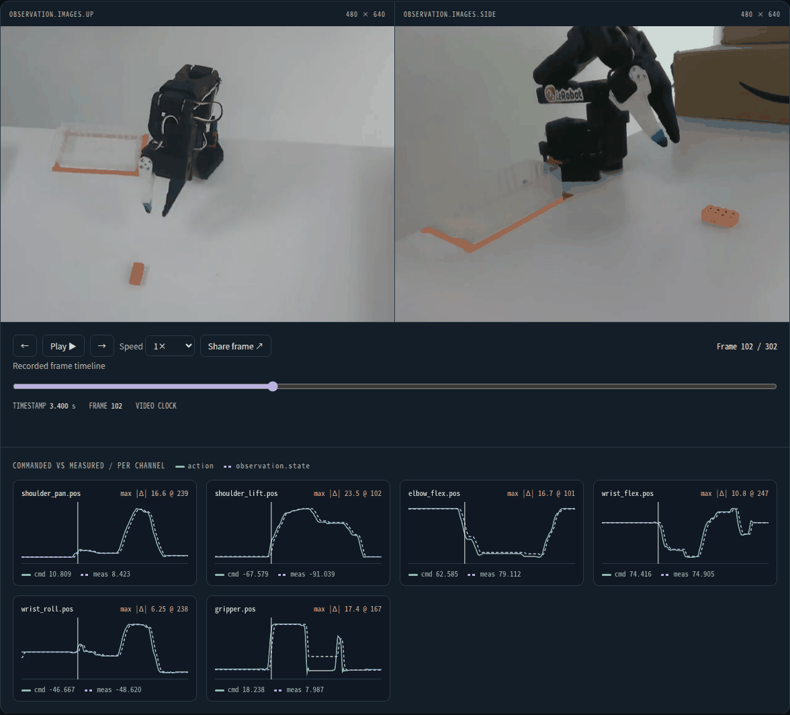

# Replay a LeRobot dataset episode

`robot-reel lerobot` turns one episode of any
[LeRobotDataset](https://huggingface.co/docs/lerobot/lerobot-dataset-v3) into a
folder you can open offline, attach to an issue or publish on GitHub Pages. It
reads the dataset's own files and does not import or install LeRobot.

**[Open the SO-101 example ↗](https://noteflowai.github.io/robot-reel/lerobot/)**:
episode 0 of [`lerobot/svla_so101_pickplace`](https://huggingface.co/datasets/lerobot/svla_so101_pickplace),
the real SO-101 pick-and-place data used to fine-tune SmolVLA. Two cameras, six
joints, 303 frames at 30 fps.

[](https://noteflowai.github.io/robot-reel/lerobot/)

## Quick start

```bash
python3.12 -m venv .venv
source .venv/bin/activate
python -m pip install 'robot-reel[lerobot]==0.15.0'

# Any public Hub dataset; only the files this episode needs are downloaded.
robot-reel lerobot lerobot/svla_so101_pickplace --episode 0 --output artifacts/so101

# Or a dataset on disk, e.g. one you just recorded with lerobot-record.
robot-reel lerobot ~/.cache/huggingface/lerobot/you/your_dataset --episode 3 --output artifacts/mine
```

Open `artifacts/so101/index.html` directly from disk. The SO-101 export above
took 15 seconds in our test on a CPU, including the download; no GPU is used.
Private or gated Hub datasets use your existing `hf auth login` token.

## What the replay shows

- **Every camera on one clock.** Each `video` feature is cut from its source
  file at the episode's recorded offset (`from_timestamp` in v3.0 files that
  hold many episodes) and re-encoded to H.264, so the clip holds exactly the
  episode's frames and plays in any browser. `image` features stored inside the
  parquet file (PNG or JPEG) are encoded the same way.
- **Commanded versus measured.** When `action` and `observation.state` share
  channel names, as LeRobot follower arms do, each joint gets its own panel with
  both curves and a link to the frame with the largest recorded difference.
  Other numeric features (rewards, `next.done`, extra sensors up to 64 values
  per frame) are plotted on their own.
- **The language task**, episode length and frame rate, plus frame stepping,
  playback speed, keyboard control (← → Space Home End) and shareable
  `#frame=N` links.
- **Provenance.** `episode.json` holds every exported value, the Hub commit the
  export was pinned to (a branch or tag given with `--revision` is resolved to
  its commit) and the SHA-256 of each source file used. The folder's
  `manifest.json` fingerprints the page, the data and every clip.

Floating-point values are written as the shortest decimal that reads back to
the same source number, so `episode.json` can be compared with the parquet file
exactly. Features the viewer cannot plot are listed under `skipped` with the
reason. Units are the dataset's own; Robot Reel does not rescale them.

## Verify an export

```bash
# Standard library only: manifest, schema and the page's embedded data.
robot-reel lerobot artifacts/so101 --verify

# Count every decoded camera frame against the episode length.
robot-reel lerobot artifacts/so101 --verify --check-media

# Re-read the pinned source dataset and compare every exported value and file hash.
robot-reel lerobot artifacts/so101 --verify --check-source
robot-reel lerobot artifacts/mine --verify --check-source --dataset ~/path/to/your_dataset
```

CI runs all three checks against a fresh export of the published example, and
the unit tests cut the second episode out of a shared v3.0 video and a v2.1
per-episode video, then decode each clip frame to confirm it came from that
episode, in order.

## Supported datasets and limits

- LeRobotDataset **v3.0** (current) and **v2.0 / v2.1**. Older v1.x datasets
  should be converted with LeRobot's own conversion script first.
- One episode per export, up to 20,000 frames. Numeric features with more than
  64 values per frame (for example embeddings or depth arrays stored in parquet)
  are skipped and listed.
- Clips are lossy H.264 viewing copies (`--crf 23` by default; lower values are
  larger and closer to the source). The source videos' hashes are recorded,
  not their pixels.
- The replay shows what the dataset recorded. It does not judge success,
  calibrate units or infer contacts.

Rerun 0.38 added a reader that streams LeRobot datasets into its native viewer; use that
for live, multi-episode exploration, and this export when you need a single
self-contained folder that opens anywhere and carries its own checksums. The
[Hugging Face LeRobot visualizer](https://huggingface.co/spaces/lerobot/visualize_dataset)
browses public Hub datasets online; each exported page links to its episode there.
