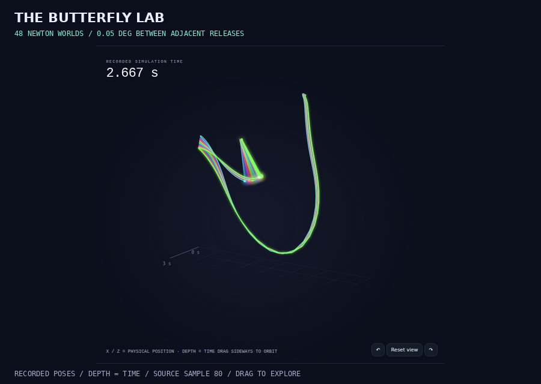

# GPU sweep export check

This three-second Newton recording checks the 48-world GPU export path. It
contains 91 source frames and 8,736 body poses, recorded on an NVIDIA L40S.
The public Butterfly Lab remains its original twelve-world CPU experiment.

[Download the offline experiment](experiment.zip) ·
[Verification details](verification.json)



Unzip the experiment and open `index.html`. The page, media notice and USD source
metadata identify 48 GPU worlds; the 96 animated links are centered along the
presentation Y axis. Original simulation poses remain unchanged.

OpenUSD checks every body at every source frame. Blender 4.5.13 independently
imports the scene and checks the same samples, with a maximum transform error
of about 0.000000534 m. Browser checks cover 1440, 390 and 320 px, keyboard access
to world 48, the last source sample, and the description with JavaScript disabled.
The archive contains the trace, USD, viewer, native reports, hashes and license.

Reproduce using the [GPU recording and native-check commands](../../docs/chaos.md).
After extracting this archive, its data and viewer can also be checked without
a simulation runtime:

```bash
python3 -S -m robot_reel.chaos --output /path/to/extracted-experiment --verify
```

This is an export validation case. It does not compare CPU/GPU speed or establish
performance across different devices and sweep sizes. Code, procedural geometry
and recorded data are Apache-2.0.
